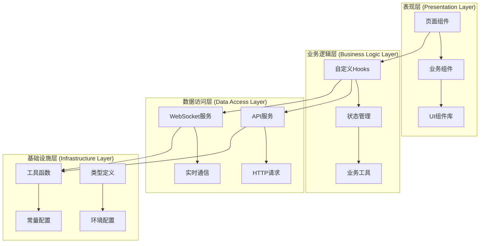
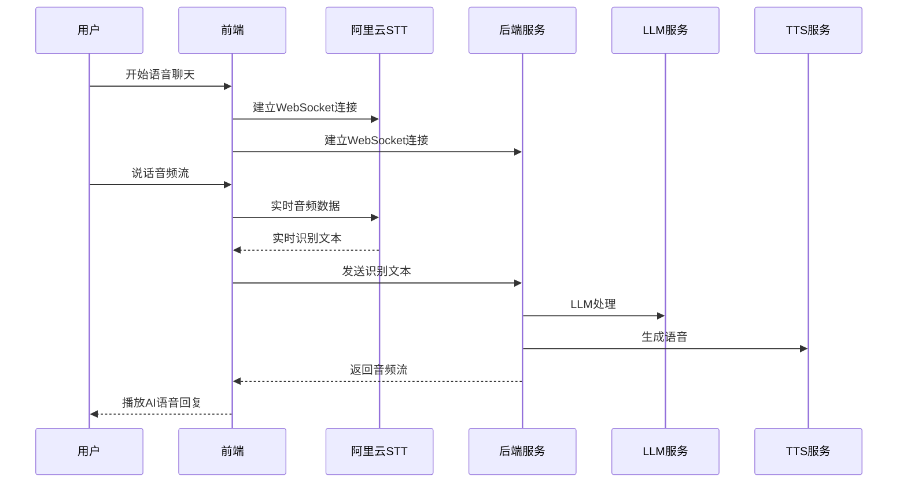

# 前端架构设计文档

## 概述

本文档描述了AI角色聊天平台的前端架构设计，基于React + TypeScript + UmiJS技术栈，实现了角色管理、实时语音聊天和文本聊天功能。该架构采用模块化设计，支持可扩展的组件复用和状态管理。

## 技术栈

### 核心技术
- **前端框架**: React 18 + TypeScript 4.x
- **构建工具**: UmiJS 4.x
- **UI组件库**: Ant Design 5.x + Pro Components
- **状态管理**: React Hooks + 页面级状态管理
- **路由管理**: UmiJS内置路由系统
- **HTTP请求**: UmiJS内置request（基于axios）

### 实时通信技术
- **WebSocket**: 双连接架构
  - 连接1: 前端 ↔ 阿里云STT服务（语音识别）
  - 连接2: 前端 ↔ 后端服务（文本/音频流传输）
- **音频处理**: Web Audio API + MediaRecorder API
- **语音识别**: 阿里云实时语音识别服务
- **音频格式**: PCM 16kHz 16bit单声道

## 项目结构

```
src/
├── assets/                    # 静态资源
├── components/               # 通用组件
│   ├── Footer/              # 页脚组件
│   ├── HeaderDropdown/      # 头部下拉菜单
│   ├── RightContent/        # 头部右侧内容
│   │   ├── AvatarDropdown.tsx    # 用户头像下拉
│   │   ├── HeaderActions.tsx     # 头部操作按钮
│   │   └── SessionHistory.tsx    # 会话历史
│   └── Role/               # 角色相关组件
│       └── RoleCard/       # 角色卡片组件
├── constants/              # 常量定义
│   ├── index.ts           # 通用常量
│   └── voiceModels.ts     # 语音模型配置
├── hooks/                 # 自定义Hooks
│   ├── useWebSocket.ts    # WebSocket通信Hook
│   └── useAliSpeechRecognition.ts  # 阿里云语音识别Hook
├── pages/                 # 页面组件
│   ├── Chat/             # 聊天相关页面
│   │   └── AIChat/       # AI聊天主页面
│   ├── Role/             # 角色相关页面
│   │   ├── Home/         # 角色主页
│   │   ├── Create/       # 创建角色
│   │   ├── Detail/       # 角色详情
│   │   ├── Edit/         # 编辑角色
│   │   └── Chat/         # 角色聊天（重定向到AIChat）
│   ├── User/             # 用户相关页面
│   │   ├── Login/        # 登录页面
│   │   └── Register/     # 注册页面
│   ├── Welcome.tsx       # 欢迎页面
│   └── 404.tsx          # 404页面
├── services/             # API服务层
│   └── backend/         # 后端API
│       ├── api.ts       # 通用API
│       ├── character.ts # 角色相关API
│       ├── chat.ts      # 聊天相关API
│       ├── user.ts      # 用户相关API
│       └── typings.d.ts # API类型定义
├── types/               # 类型定义
├── utils/               # 工具函数
│   └── token.ts         # Token管理工具
├── app.tsx             # 应用入口
├── access.ts           # 权限配置
└── global.tsx          # 全局配置
```

## 架构设计

### 1. 分层架构



### 2. 组件架构

#### 页面组件层级
```
PageContainer (Ant Design Pro)
├── RoleHome (角色主页)
│   ├── 我的角色区域
│   │   └── RoleCard[] (横向滚动)
│   ├── 标签筛选器
│   └── 发现角色区域
│       └── RoleCard[] (网格布局)
├── RoleCreate (创建角色)
├── RoleDetail (角色详情)
├── RoleChat → AIChat (聊天页面)
└── AIChat (AI聊天主页面)
    ├── 聊天头部
    ├── 消息列表
    ├── 语音状态显示
    └── 输入区域
```

#### 组件设计原则
- **单一职责**: 每个组件专注单一功能
- **可复用性**: 通过props实现组件复用
- **状态提升**: 共享状态提升到父组件
- **组件组合**: 通过组合而非继承实现复杂功能

### 3. 状态管理

#### 页面级状态管理
采用React Hooks进行本地状态管理，避免全局状态的复杂性：

```typescript
// 角色主页状态管理示例
const RoleHome = () => {
  const [myRoles, setMyRoles] = useState<API.Character[]>([]);
  const [discoverRoles, setDiscoverRoles] = useState<API.Character[]>([]);
  const [searchResults, setSearchResults] = useState<API.Character[]>([]);
  const [loading, setLoading] = useState({
    myRoles: false,
    discover: false,
    search: false,
  });
  const [pagination, setPagination] = useState({
    myRoles: { page: 1, pageSize: 8, hasMore: true },
    discover: { page: 1, pageSize: 12, hasMore: true },
  });
  
  // 业务逻辑...
};
```

#### 状态管理策略
- **本地状态**: 使用useState管理组件内部状态
- **副作用**: 使用useEffect处理数据获取和清理
- **性能优化**: 使用useCallback和useMemo优化重渲染
- **用户状态**: 通过UmiJS的useModel管理全局用户信息

### 4. 路由设计

#### 路由配置
```typescript
// config/routes.ts
export default [
  // 用户认证路由
  {
    path: '/user',
    layout: false,
    routes: [
      { path: '/user/login', component: './User/Login' },
      { path: '/user/register', component: './User/Register' },
    ],
  },
  
  // 主要功能路由
  { path: '/welcome', component: './Welcome', hideInMenu: true },
  { path: '/home', component: './Role/Home', name: 'AI角色主页', access: 'canUser' },
  
  // 角色管理路由
  { path: '/role/create', component: './Role/Create', hideInMenu: true, access: 'canUser' },
  { path: '/role/edit/:id', component: './Role/Edit', hideInMenu: true, access: 'canUser' },
  { path: '/role/detail/:id', component: './Role/Detail', hideInMenu: true, access: 'canUser' },
  { path: '/role/chat/:id', component: './Role/Chat', hideInMenu: true, access: 'canUser' },
  
  // 默认路由
  { path: '/', redirect: '/home' },
  { path: '*', layout: false, component: './404' },
];
```

#### 路由特点
- **权限控制**: 通过access字段控制页面访问权限
- **参数传递**: 支持动态路由参数（如/:id）
- **布局控制**: 通过layout字段控制页面布局
- **菜单隐藏**: 通过hideInMenu控制菜单显示

## 核心功能模块

### 1. 角色管理模块

#### 功能特性
- **角色创建**: 支持自定义角色信息、头像、标签、声音模型
- **角色编辑**: 修改角色属性和设置
- **角色浏览**: 网格和横向滚动两种展示模式
- **角色搜索**: 基于名称、描述、标签的实时搜索
- **标签筛选**: 动态标签筛选和展开/收缩

#### 数据流
```
用户操作 → 页面状态更新 → API调用 → 后端处理 → 响应数据 → 状态更新 → UI重渲染
```

### 2. 实时聊天模块

#### 双WebSocket架构


#### 消息类型定义
```typescript
// WebSocket消息协议
interface RequestMessage {
  type: 'auth' | 'text' | 'voice';
  token?: string;
  content: string;
}

interface ResponseMessage {
  type: 'message' | 'delta' | 'done' | 'audio';
  msg?: Message;
  content?: string;
  audio?: ArrayBuffer;
}
```

### 3. 语音识别模块

#### 阿里云STT集成
- **实时识别**: 支持边说边识别的实时转写
- **音频格式**: PCM 16kHz 16bit单声道
- **连接管理**: 自动连接、断线重连、资源清理
- **权限处理**: 麦克风权限检测和用户友好提示

#### Hook设计
```typescript
const useAliSpeechRecognition = (options) => {
  return {
    isConnected: boolean,
    isRecording: boolean,
    currentText: string,
    connect: (config) => void,
    disconnect: () => void,
    startRecording: () => void,
    stopRecording: () => void,
  };
};
```

## API设计

### 1. 类型定义
```typescript
declare namespace API {
  // 角色类型
  type Character = {
    id: number;
    background: string;
    name: string;
    avatar: string;
    description: string;
    open_line: string;
    tags: string[];
    is_public: boolean;
    user_id: number;
    user_name: string;
    created_at: number;
    updated_at: number;
  };
  
  // 会话类型
  type Session = {
    session_id: number;
    user_id: number;
    character_id: number;
    title: string;
    created_at: number;
    updated_at: number;
  };
  
  // 标签类型
  type Tag = {
    id: number;
    name: string;
  };
}
```

### 2. API服务
```typescript
// 角色相关API
export async function getCharacter(params: API.getCharacterParams);
export async function newCharacter(body: API.NewCharacterRequest);

// 聊天相关API
export async function newSession(body: API.NewSessionRequest);
export async function getSession(params: API.getSessionParams);

// 通用API
export async function getTags();
export async function uploadToken(body: API.UploadTokenRequest);
```

## 性能优化

### 1. 渲染优化
- **React.memo**: 优化组件重渲染
- **useCallback**: 缓存函数引用
- **useMemo**: 缓存计算结果
- **虚拟滚动**: 处理大量角色数据

### 2. 网络优化
- **请求缓存**: 避免重复API调用
- **分页加载**: 减少初始加载时间
- **WebSocket复用**: 高效的实时通信

### 3. 音频优化
- **音频对象池**: 复用音频对象
- **资源清理**: 及时释放音频资源
- **格式优化**: 使用高效的音频编码

## 用户体验设计

### 1. 响应式设计
- **网格自适应**: 根据屏幕尺寸调整角色卡片布局
- **横向滚动**: 移动端友好的角色展示
- **标签自适应**: 动态计算标签显示数量

### 2. 交互优化
- **实时搜索**: 输入即搜索，无需点击
- **语音可视化**: 录音状态和音量指示
- **加载状态**: 详细的加载和错误状态提示

### 3. 无障碍支持
- **键盘导航**: 支持Tab键导航
- **屏幕阅读器**: 语义化HTML结构
- **颜色对比**: 符合WCAG标准的颜色对比度

## 安全考虑

### 1. 认证授权
- **JWT双Token**: AccessToken + RefreshToken机制
- **权限控制**: 基于角色的页面访问控制
- **Token刷新**: 自动token刷新和过期处理

### 2. 数据安全
- **输入验证**: 客户端和服务端双重验证
- **XSS防护**: 内容转义和CSP策略
- **HTTPS**: 所有通信使用HTTPS加密

### 3. 隐私保护
- **音频处理**: 音频数据不在本地持久化
- **权限申请**: 明确的麦克风权限说明
- **数据清理**: 及时清理敏感数据

## 错误处理

### 1. 网络错误
- **超时处理**: 设置合理的请求超时时间
- **重试机制**: 自动重试失败的请求
- **降级方案**: 网络异常时的功能降级

### 2. 音频错误
- **权限错误**: 友好的权限申请提示
- **设备错误**: 音频设备检测和故障提示
- **格式错误**: 音频格式兼容性处理

### 3. 用户体验
- **错误提示**: 用户友好的错误信息
- **操作指引**: 错误恢复的操作建议
- **状态保持**: 错误后的状态恢复

## 测试策略

### 1. 单元测试
- **组件测试**: React Testing Library
- **Hook测试**: 自定义Hook的单元测试
- **工具函数测试**: 纯函数的单元测试

### 2. 集成测试
- **API测试**: 模拟API响应的集成测试
- **WebSocket测试**: 实时通信的集成测试
- **用户流程测试**: 完整用户场景测试

### 3. 端到端测试
- **Playwright**: 浏览器自动化测试
- **用户场景**: 完整的用户操作流程
- **跨浏览器**: 多浏览器兼容性测试

## 部署和监控

### 1. 构建优化
- **代码分割**: 按路由分割代码包
- **Tree Shaking**: 删除未使用的代码
- **资源压缩**: 图片和静态资源优化

### 2. 性能监控
- **页面性能**: Core Web Vitals监控
- **API性能**: 请求响应时间监控
- **错误监控**: 前端错误收集和报警

### 3. 用户行为
- **用户行为分析**: 功能使用统计
- **性能分析**: 用户设备和网络分析
- **A/B测试**: 功能和界面优化测试

## 未来扩展

### 1. 功能扩展
- **角色收藏**: 用户收藏喜欢的角色
- **社交分享**: 角色和对话分享功能
- **多语言支持**: 国际化和本地化
- **主题定制**: 用户界面主题切换

### 2. 技术升级
- **React 19**: 升级到最新React版本
- **Web Components**: 组件标准化
- **PWA**: 渐进式Web应用支持
- **WebRTC**: P2P音视频通信

### 3. 性能优化
- **CDN加速**: 静态资源CDN分发
- **Service Worker**: 离线缓存支持
- **HTTP/3**: 新一代HTTP协议支持
- **边缘计算**: 就近部署和计算

## 总结

本前端架构采用现代化的React技术栈，通过模块化设计实现了高可维护性和可扩展性。双WebSocket架构支持了复杂的实时语音交互需求，而页面级状态管理保持了应用的简洁性。完善的错误处理和性能优化确保了良好的用户体验，为未来的功能扩展奠定了坚实的基础。
